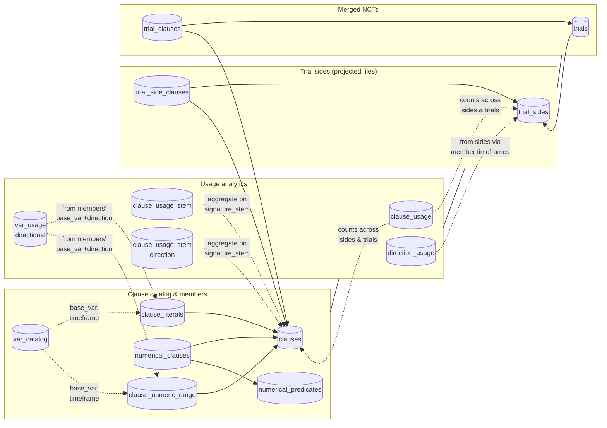

```mermaid
%%{init: {
  "flowchart": { "htmlLabels": true, "curve": "basis", "nodeSpacing": 14, "rankSpacing": 28, "padding": 4 },
  "themeVariables": { "fontSize": "12px" }
}}%%
flowchart LR

  %% ===== Clause catalog & members =====
  subgraph C["Clause catalog & members"]
  direction TB
    clauses[("clauses")]
    clits[("clause_literals")]
    ncl[("numerical_clauses")]
    npred[("numerical_predicates")]
    cnr[("clause_numeric_range")]
    varcat[("var_catalog")]
  end

  %% ===== Usage analytics =====
  subgraph U["Usage analytics"]
  direction TB
    cu[("clause_usage")]
    cus[("clause_usage_stem")]
    cusd[("clause_usage_stem<br/>direction")]
    vud[("var_usage<br/>directional")]
    du[("direction_usage")]
  end

  %% ===== Trial sides (projected files) =====
  subgraph S["Trial sides (projected files)"]
  direction TB
    ts[("trial_sides")]
    tsc[("trial_side_clauses")]
  end

  %% ===== Merged NCTs =====
  subgraph M["Merged NCTs"]
  direction TB
    trials[("trials")]
    tclauses[("trial_clauses")]
  end

  %% ---------- FK-driven relations (solid) ----------
  tsc --> ts
  tsc --> clauses

  clits --> clauses
  ncl   --> clauses
  ncl   --> npred
  cnr   --> clauses

  trials --> ts
  tclauses --> trials
  tclauses --> clauses

  %% ---------- Derived/semantic relations (dashed with labels) ----------
  varcat -. base_var,<br/>timeframe .-> clits
  varcat -. base_var,<br/>timeframe .-> cnr

  cu   -. counts across<br/>sides & trials .-> clauses
  cu   -. counts across<br/>sides & trials .-> ts
  cus  -. aggregate on<br/>signature_stem .-> clauses
  cusd -. aggregate on<br/>signature_stem .-> clauses

  vud -. from members'<br/>base_var+direction .-> clits
  vud -. from members'<br/>base_var+direction .-> cnr
  du  -. from sides via<br/>member timeframes .-> ts

  %% Horizontal nudge between groups
  C --- U
  U --- S
  S --- M


```